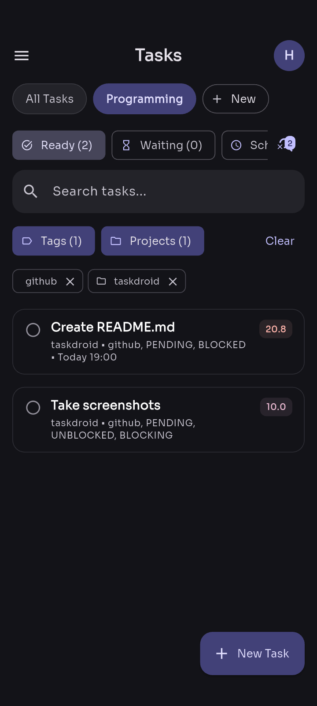
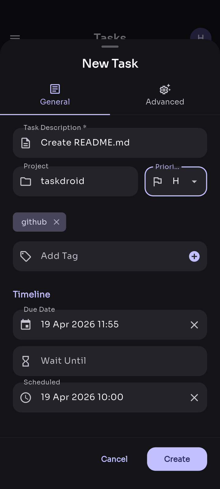
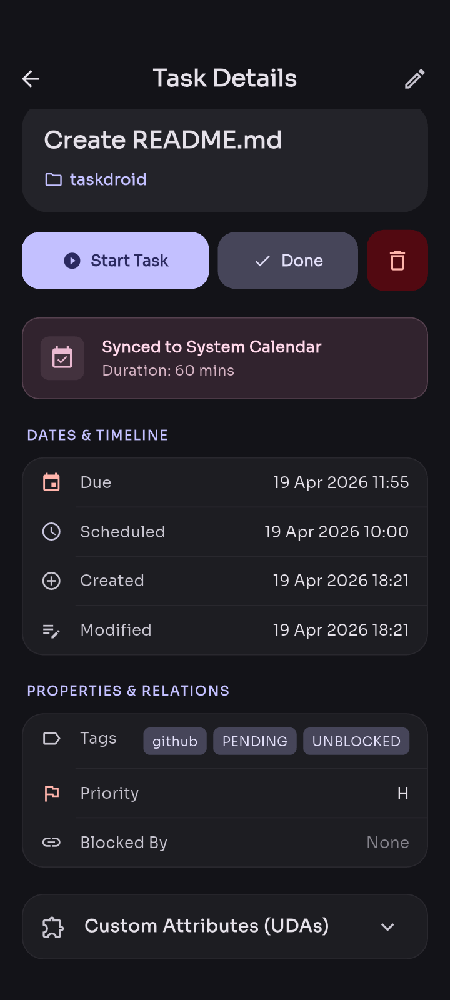
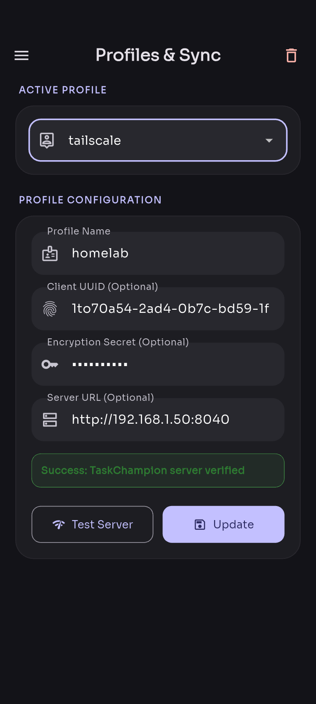
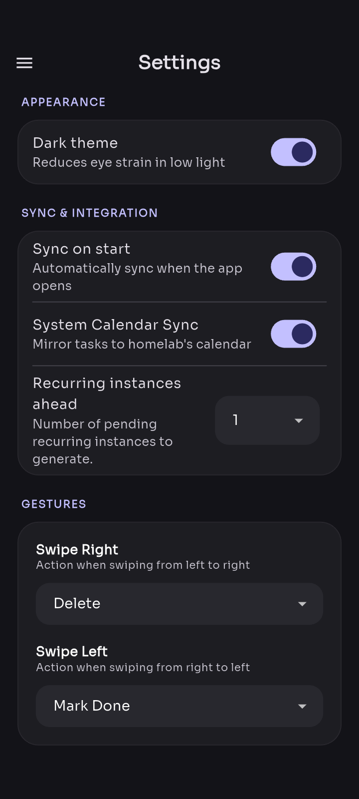
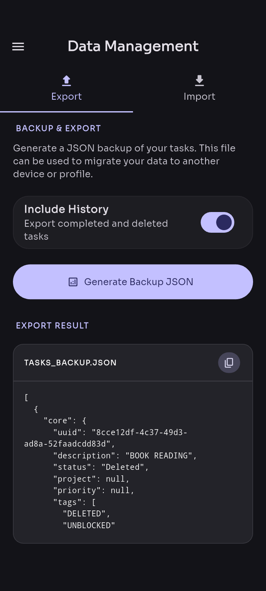

# Taskdroid

> A simple, usable, and modern mobile client for [Taskwarrior](https://taskwarrior.org/).


[](https://www.gnu.org/licenses/gpl-3.0)

## Features

- **Full sync** – Works with Taskchampion server
- **Multi-profile** – Switch between different profile instances
- **Saved custom filters** – One tap to see your "urgent" or "work" views
- **User-friendly UI** – Built for touch, not just terminal
- **Custom attributes** – Keep your metadata intact
- **Local calendar sync** – One‑way sync to your device calendar
- **Export & import** – Move tasks in and out easily
- **Annotations support** – Add notes and updates to any task

## Screenshots

| Home                                                    | Add Task                                                        | Task Details                                                            | Profile                                                       | Settings                                                        | Export/Import                                                             |
| ------------------------------------------------------- | --------------------------------------------------------------- | ----------------------------------------------------------------------- | ------------------------------------------------------------- | --------------------------------------------------------------- | ------------------------------------------------------------------------- |
|  |  |  |  |  |  |

---

### Installation

#### Download a signed APK release (recommended)

Head to the [Releases](https://github.com/taskdroid/taskdroid/releases) page and grab the latest `.apk`.

#### Build from source

```bash
git clone https://github.com/taskdroid/taskdroid.git
cd taskdroid
./build.sh --release --split
```
